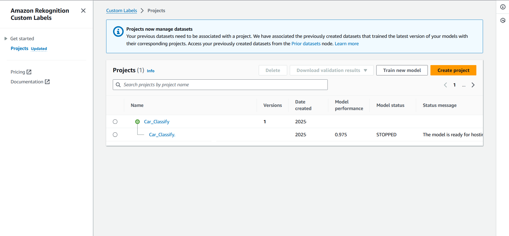
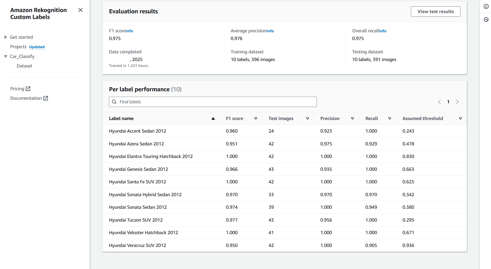

# Terraform AWS Rekognition Custom Labels for Car Detection Deployment

This project demonstrates how to deploy an **AWS Rekognition Custom Labels model for car detection** along with a supporting **detection system** using **Terraform**.  
It provisions AWS serverless services to ensure automation, scalability, and simplicity.

The system is a **cloud-native image analysis portal** that leverages **Amazon Rekognition Custom Labels** to detect and classify cars from uploaded images.  
It provides an end-to-end workflow—from training the model to exposing detection results via a user-friendly web interface.  

---

## Project Overview

By completing this project, you will:

- Learn how to provision AWS resources using Terraform  
- Train and deploy a **Rekognition Custom Labels model** for car detection  
- Set up **API Gateway** as a managed REST API layer  
- Implement **AWS Lambda** for serverless image processing  
- Store results in **Amazon DynamoDB** (NoSQL database)  
- Deploy a **web application on EC2** for user interaction  
- Gain hands-on experience with a complete AWS cloud serverless infrastructure  

---

## 1. Project Details

### Architecture Phases

- **Phase 1 – Rekognition Model Training**  
  - Train a **Custom Labels model** in Amazon Rekognition  
  - Prepare and upload labeled datasets (training + testing)  
  - Optimize costs by starting the model only when needed  

- **Phase 2 – Deploy Detection Services**  
  Terraform provisions:  
  - **EC2** instance with Apache + PHP  
  - **API Gateway** as a RESTful interface  
  - **AWS Lambda** for invoking Rekognition  
  - **DynamoDB** to store detection results  

- **Phase 3 – Application Workflow**  
  1. User uploads an image via the web app  
  2. API Gateway triggers Lambda  
  3. Lambda calls Rekognition  
  4. Results are saved in DynamoDB  
  5. Web app displays classification labels with confidence scores  

---

### Rekognition Custom Label Model Training and Testing

To build your dataset, start by exploring links in the **Resources** section.  

My training process began with a focused dataset:  
- **Manufacturer:** Hyundai  
- **Year:** 2012  
- **Car Models:** 10 models selected  
- Dataset split into training and testing for validation  

Guidance and step-by-step instructions are available in **AWS documentation** and **YouTube tutorials**.  

➡️ You can incrementally improve the model by adding:  
- More manufacturers  
- Additional production years  
- Extra car models  

This allows you to **refine accuracy** and **extend coverage** over time.  

> 🔒 Images were sourced from the project’s **Image folder** and the **web interface**, while keeping sensitive information secure.  

#### Sample Training & Results  

<p align="center">
  
  
</p>  

*Left: Rekognition Project Model | Right: Model Results after Training*  

---

## Sample Web Interface Output

When a user uploads an image, the interface displays detection results.  

<p align="center">
  
  
</p>  

**Left:** ✅ Car Detected – Labels and confidence scores (e.g., Hyundai Elantra 2012 – 98.5%).  
**Right:** ⚠️ Multiple Labels Detected – Confidence scores are low, indicating possible misclassification.  

---

## Architecture Diagram

  
*Illustrates EC2, API Gateway, Lambda, DynamoDB, and Rekognition workflow.*  

---

## Terraform Project Structure

```
terraform-project/
│── main.tf
│── variables.tf
│── outputs.tf
│── provider.tf
├── user_data.sh   
├── index.zip
│
├── lambda/
│     └── detect.zip 
```

---

## Cost Optimization Notes

- Training a Custom Labels model is relatively inexpensive  
- The **main costs occur when the model is running for long time**  
- Stop the model when not in use to avoid unnecessary charges  
- Destroy the Terraform stack after testing if not needed  

---

## Features

- End-to-end car detection using **Rekognition Custom Labels**  
- Automatic result logging in DynamoDB  
- Serverless-first architecture with AWS services  
- Simple web interface for real-time interaction  
- Easy extension by plugging in your own Rekognition model  

---

## Prerequisites

- Terraform ≥ 1.3  
- Download `Terraform_Full_Project.zip`  
- Update `/variables.tf` with your AWS Region and Rekognition ARN  
- Configure `/provider.tf` with your AWS CLI profile  
- Ensure AWS Secrets are created (see AWS documentation)  

---

## Example `/variables.tf`

```hcl
aws_region            = "us-east-1"
rekognition_model_arn = "arn:aws:rekognition:us-east-1:123456789012:project/xxxx/version/xxxx/xxxx"
```

---

## Example `/provider.tf`

```hcl
provider "aws" {
  region  = var.aws_region
  profile = "<Your-Profile>"
}
```

---

## Getting Started

1. **Extract Project**  
   ```bash
   unzip Terraform_Full_Project.zip -d terraform_project
   cd terraform_project
   ```

2. **Start the Rekognition model** 
   Take time to be ready

3. **Initialize Terraform**  
   ```bash
   terraform init
   ```

4. **Review Plan**  
   ```bash
   terraform plan
   ```

5. **Apply Configuration**  
   ```bash
   terraform apply
   ```

6. **Access the Web App** via the EC2 Public IP using **HTTPS://** 

7. **Stop the Rekognition model** when not in use to save cost  

8. **Tear down the project when done**  
   ```bash
   terraform destroy
   ```

---

## Instance Types and Lambda Code

- **EC2**: t2.micro – Apache + PHP with HTTPS  
- **Lambda**: Python 3.13  

---

## Notes

- Rekognition Custom Labels is not available in all regions  
- All services must be in the same AWS Region  
- Test the pipeline using **CloudWatch logs** and verify **JSON results in DynamoDB** before starting the model to save cost  

---

## Troubleshooting

- Verify AWS credentials and region in `provider.tf`  
- Check Rekognition ARN in `variables.tf`  
- Confirm security group rules  
- Inspect Terraform logs for deployment issues  

---

## Resources

- Example Car Datasets:  
   - [Kaggle](https://www.kaggle.com/datasets)  
   - [MMLab](https://mmlab.ie.cuhk.edu.hk/)  

---

## License

This project is licensed under the **MIT License**.  
