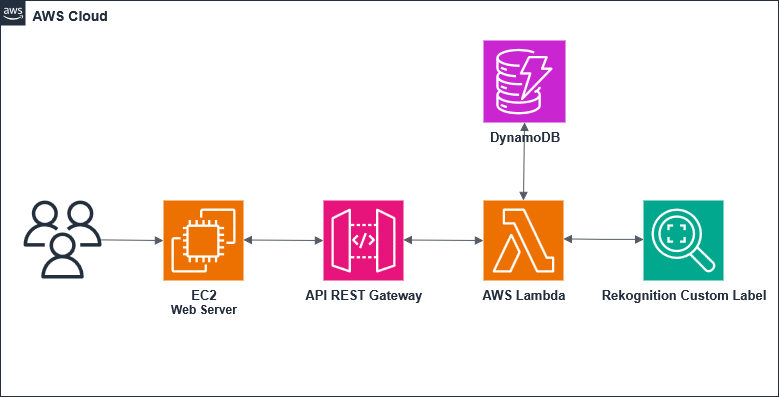

# Terraform AWS Rekognition Custom Label for Cars Detection Deployment

This project demonstrates how to deploy a **Rekognition Custom Label for Cars** and a **Detection System** on AWS using **Terraform**.  
It provisions multiple AWS serverless services to ensure **performance, and easy process**.

---

## Project Overview

By following this project, you will:

- Understand how to provision AWS resources using Terraform  
- Deploy a **Rekognition Custom Label** 
- Deploy a **REST API Gateway**
- Learn how to set up **Lambda** 
- Learn how to set up **DynamoDB** 
- Gain hands-on experience building a complete AWS cloud serverless infrastructure  

---

## 1. Project Details

### Architecture Overview
- **Face 1 (Train Model for cars in Rekognition Custom Label)**  
  - Application Load Balancer (ALB) in public subnets  
  - EC2 instances in **public subnets**   
  - Amazon Certificate Manager (ACM) TLS certificate for HTTPS  
  - Cognito to control access to the website using User ID and Password

- **Face 2 (Deploy services to interact with model)**  
  - Deploy a **REST API Gateway**
  - Learn how to set up **Lambda** 
  - Learn how to set up **DynamoDB**   

- **Face 3 (Design simple design web inetrface for users)**  
  - Secure Web Server in EC2 instance. 
  
- **Supporting Services**  
  - **IAM**: Fine-grained roles for EC2, Lambda, DynamoDB, and REST API Gateway    

### Rekognition Custom Label Model Training and Testing

follow link to AWS youtube sites

Images from Image folder and web interface keep info secert

my experience to train small model first by select one manufacture Hyundai, one year 2012, and 10 car models for traininig dataset and test dataset(check)

and there are options for adding more dataset to upgrade the model

- **VPC Module** – Networking (VPC, subnets, NAT, routing, gateways)  
- 
---


## Architecture Diagram

  
*Shows EC2, REST API Gateway, Lambda, DynamoDB, and Rekognition Custom Label  workflow.*

---

## Description for Lambda process

---

## Notes for cost and how to decrease it

---

## how to find dataset and where you get from

---

## link to structure file

---

## Features

- Fully automated deployment with **Terraform**  
- **Simple Desgin** 
- Integration Car Detcect website frontend with Rekognition backend  

---

## Prerequisites

- Terraform >= 1.3  
- Download `Terraform_Full_Project.zip`
- Change `<Your-Region>` in `/variables.tf`
- Add your Rekognition ARN `/variables.tf`
- Change to your profile `<Your-Profile>` in `/provider.tf`. Create your secrets and save them **Follow AWS Guides**  

---

## Example `/variables.tf`

```hcl
aws_region            = "us-east-1"
rekognition_model_arn = "arn:aws:rekognition:us-east-1:123456789012:project/xxxxxxxx/version/xxxxxxxx.xxxxxxxx/xxxxxxxx
```

---

## Example `/provider.tf`

```hcl
provider "aws" {
  region  = var.aws_region
  profile = "<Your-Profile>"
}
```

---

## Getting Started

1. **Clone or Unzip** the project:
   ```bash
   unzip Terraform_Full_Project.zip -d terraform_project
   cd terraform_project
   ```

2. **Start the model**
   Take time to be ready

3. **Initialize Terraform**:
   ```bash
   terraform init
   ```

4. **Review the Plan**:
   ```bash
   terraform plan
   ```

5. **Apply the Configuration**:
   ```bash
   terraform apply
   ```

6. **Access the App** using the EC2 IP once deployed

7. **!Attention** Stop model if you are not using it for cost 

8. **Remember to destroy the project and stop model after finish**:
   ```bash
   terraform destroy
   ```

---

## Instance Types Used

- **EC2**: t2.micro
- **Lambda**: Python 3.13

---

## Notes

- Rekognition Custom Label not supported in all regions, so check for your region  
- All system must runs in **same region** 
- Check system before start module to avoid cost in Troubleshooting

---

## Troubleshooting

- Ensure your AWS credentials and region are correctly set in the provider
- Verify the Rekognition Custom Label ARN is correct ans set in variables
- Check security group rules to allow necessary traffic
- Review Terraform output for any errors during deployment

---

## Resources

- Cars Dataset Resouces
- [kaggle](https://www.kaggle.com/datasets)
- [mmlab](https://mmlab.ie.cuhk.edu.hk/)

---

## License

This project is licensed under the **MIT License**.  
